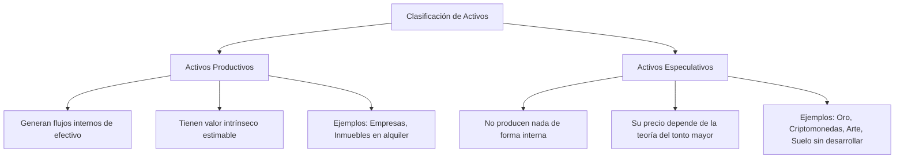

# Módulo 3 — Qué es un activo real

La educación financiera popular suele confundir los vehículos de especulación con los vehículos de inversión. En este módulo, definiremos técnicamente qué constituye un **Activo Real** y analizaremos los tres grandes pilares de la adquisición de capital: activos financieros, inmobiliarios y participaciones empresariales. Finalmente, estableceremos la frontera definitiva entre los activos que producen riqueza de forma endógena y aquellos que dependen exclusivamente de la especulación de precios.

---

## 1. La Definición de Activo Real

Para los propósitos de la Arquitectura de la Riqueza, un activo real no se define por su tangibilidad física, sino por su **capacidad de generar valor económico independiente del mercado secundario**. 

Un activo real es un derecho de propiedad sobre un sistema productivo que genera bienes, servicios o alquileres para la economía. Su valor no depende de que encuentres a alguien que te lo compre por más dinero mañana (precio); depende de la rentabilidad del motor interno que posee (valor).

```
┌────────────────────────────────────────────────────────┐
│                     ACTIVO REAL                        │
├────────────────────────────────┬───────────────────────┤
│    Sistemas Productivos        │   Generación de Flujo │
│ (Negocios, Inmuebles, Acciones)│    de Caja Interno    │
└────────────────────────────────┴───────────────────────┘
```

---

## 2. Los Tres Grandes Pilares de Acumulación

Para estructurar una cartera equilibrada, tanto la persona común como el gestor de fondos deben dominar las tres clases fundamentales de activos.

### A. Activos Financieros (Renta Variable, Deuda y Fondos)
Son derechos de propiedad o de crédito representados mediante valores negociables en mercados públicos (acciones, fondos de inversión, ETFs, bonos).

* **Para la Persona Común:** Son la puerta de entrada ideal. Ofrecen diversificación instantánea a bajo coste y permiten inyectar capital en pequeñas dosis constantes (ej. aportaciones mensuales de $150 a un ETF global de renta variable).
* **Para la Persona con Fondos:** Actúan como el "balasto" de liquidez de la cartera. Pueden ser liquidados en segundos si surge una oportunidad en el mundo real, o utilizarse como **colateral para préstamos de liquidez (créditos Lombard)**, permitiendo obtener efectivo para otras inversiones sin necesidad de vender las acciones y activar el impuesto por plusvalías.

### B. Activos Inmobiliarios (Propiedades Físicas y REITs/SOCIMIs)
Derechos de propiedad sobre parcelas de tierra y las estructuras físicas construidas sobre ellas.

* **Para la Persona Común:** Representan la primera oportunidad real de aplicar **apalancamiento financiero** de forma segura (mediante hipotecas bancarias a tipo fijo) para multiplicar su exposición a un activo real con capital de terceros.
* **Para la Persona con Fondos:** Son el pilar de la estabilidad fiscal y patrimonial. Ofrecen escudos fiscales mediante la depreciación del inmueble, permiten la deducción de intereses y son el mejor vehículo para la renegociación de deuda (equity extraction) para adquirir más propiedades.

### C. Participaciones Empresariales (Empresas Privadas y Capital Riesgo)
Tener propiedad (acciones o participaciones no cotizadas) en negocios operativos, ya sea tu propia empresa o las empresas de otros (Private Equity / Venture Capital).

* **Para la Persona Común:** Se traduce en crear una línea de negocio propia (un *side-hustle* o autoempleo escalable). Es el método más rápido para generar excedentes masivos que luego se inyectan en activos financieros o inmobiliarios.
* **Para la Persona con Fondos:** Se enfoca en inversiones en el mercado privado (Angel Investing, Private Equity). Ofrecen retornos altamente asimétricos (multiplicadores de 5x a 50x) a cambio de iliquidez absoluta y alto riesgo de pérdida de capital en operaciones individuales.

---

## 3. Activos Productivos vs. Especulativos

La diferencia clave entre construir riqueza o apostar en el casino financiero radica en comprender la diferencia entre activos **productivos** y **especulativos**.



### Tabla Comparativa de Comportamiento

| Característica | Activos Productivos | Activos Especulativos |
| :--- | :--- | :--- |
| **Fuente de Retorno** | Distribución de beneficios (dividendos, rentas) + Crecimiento interno del valor. | Dependencia exclusiva del aumento del precio en el mercado secundario. |
| **Valoración** | Basada en flujos de caja descontados (Matemática financiera). | Basada en la escasez percibida, narrativa y psicología social. |
| **Comportamiento en Crisis** | Los flujos pueden contraerse temporalmente, pero el motor sigue produciendo valor real. | El precio puede colapsar un 80-90% si la narrativa de moda desaparece. |
| **Horizonte Temporal** | Indefinido (puedes poseerlos para siempre y vivir de sus rentas). | Finito (tienes que venderlos para materializar su utilidad). |

### La Trampa del Oro y las Criptomonedas
Un kilogramo de oro o una unidad de Bitcoin son activos especulativos. No producen nada. Si los guardas en una caja de seguridad durante 20 años, seguirás teniendo exactamente un kilogramo de oro o un Bitcoin. Su utilidad económica radica únicamente en la expectativa de que el próximo comprador esté dispuesto a entregarte más bienes de consumo a cambio de ellos de lo que tú entregaste inicialmente (la "Teoría del Tonto Mayor").

Por el contrario, una hectárea de tierra agrícola fértil (activo productivo) producirá toneladas de alimentos año tras año durante esos mismos 20 años, independientemente de lo que piensen los mercados sobre el precio de la tierra.

---

## 📋 Lista de Verificación Operativa

* [ ] **Audita tu Porcentaje de Especulación:** Suma el valor de tus criptomonedas, metales preciosos, arte y terrenos rústicos sin explotar. Si esta suma representa más del 15% de tu Patrimonio Neto Productivo (PNP), estás jugando un juego de azar, no un juego de acumulación estructurada.
* [ ] **Identifica tus Motores de Flujo:** Haz una lista de cuáles de tus activos te pagaron dividendos, intereses o alquileres directos durante los últimos 12 meses.
* [ ] **Determina tu Capacidad de Colateralización:** Si tienes fondos sustanciales, contacta con tu entidad y pregunta qué porcentaje de tus activos financieros (acciones/fondos globales) aceptarían como colateral para una línea de crédito Lombard y a qué tasa de interés.
